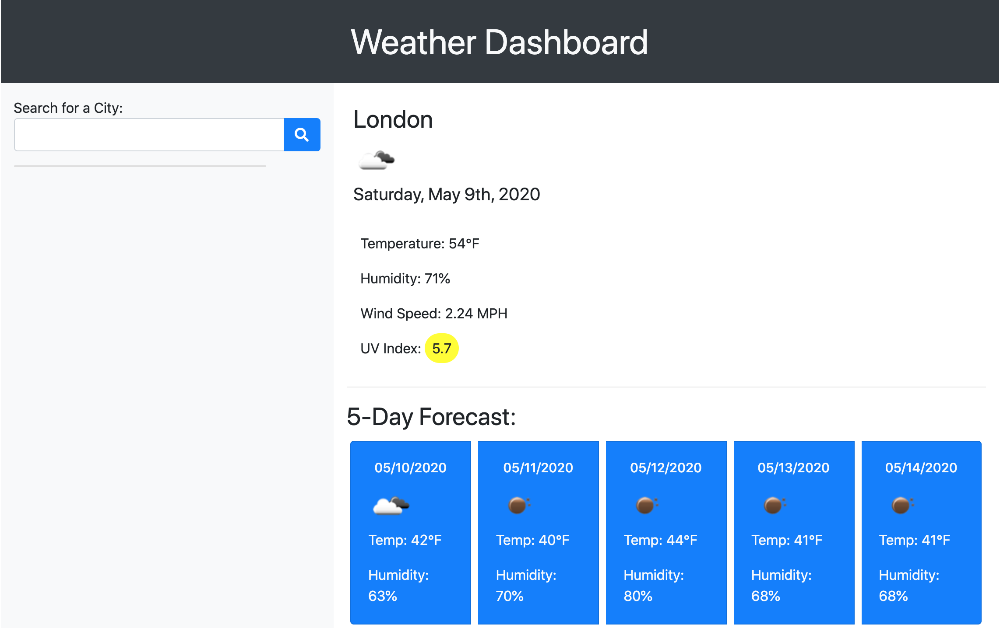
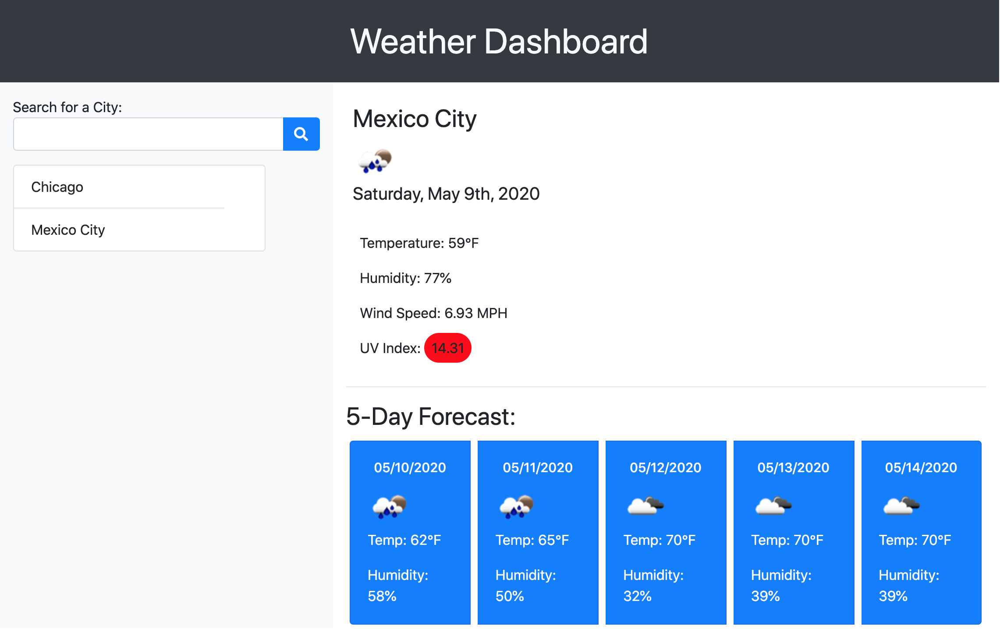
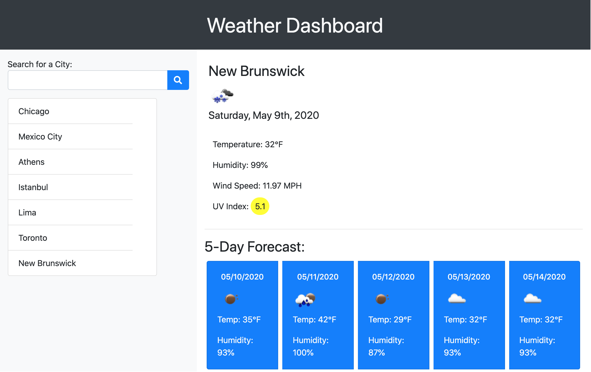

# Weather-Forecast-Search
I created a weather dashboard which lets you search for the weather of major cities around the world. It displays the current weather and a five-day forecast of the city you search.

It displays other weather information besides the temperature, including: humidity, wind speed, and UV index. To make the weather easier to digest quickly, a pictorial icon of the weather displays as well as a background color behind the UV index which changes depending on the severity of the UV index value.

## Deployed Site
[Here is the link](https://tribeofbenjamin.github.io/Weather-Forecast-Search/) to the deployed site.

## Images
#1:

#2:

#3:

